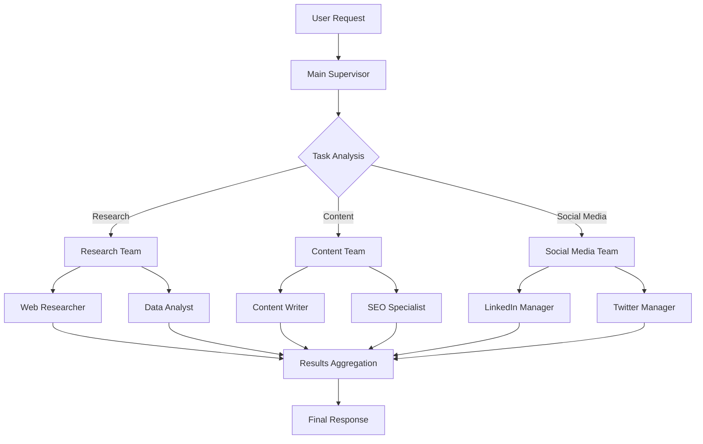

# Documentation and Testing Strategy

## Overview
This document outlines the comprehensive documentation and testing strategy for the hierarchical marketing agents system, ensuring maintainability, reliability, and ease of adoption.

## Documentation Strategy

### 1. Documentation Structure

```
docs/
├── README.md                          # Project overview
├── CONTRIBUTING.md                    # Contribution guidelines
├── CHANGELOG.md                       # Release notes
├── ARCHITECTURE.md                    # System architecture
├── API_REFERENCE.md                   # API documentation
├── DEPLOYMENT.md                      # Deployment guide
├── DEVELOPMENT.md                     # Development setup
├── OPERATIONS.md                      # Operations guide
├── TROUBLESHOOTING.md                 # Troubleshooting guide
├── SECURITY.md                        # Security guidelines
└── examples/                          # Code examples
    ├── basic_usage.py
    ├── custom_agents.py
    ├── workflow_examples.py
    └── integration_examples.py
```

### 2. API Documentation (OpenAPI/Swagger)

```python
# FastAPI application with automatic OpenAPI documentation
from fastapi import FastAPI, HTTPException
from fastapi.middleware.cors import CORSMiddleware
from pydantic import BaseModel
from typing import List, Optional
import uvicorn

app = FastAPI(
    title="Marketing Agents API",
    description="Hierarchical marketing agents system for automated marketing workflows",
    version="1.0.0",
    docs_url="/docs",
    redoc_url="/redoc",
    openapi_url="/openapi.json"
)

# CORS middleware
app.add_middleware(
    CORSMiddleware,
    allow_origins=["*"],
    allow_credentials=True,
    allow_methods=["*"],
    allow_headers=["*"],
)

# Request/Response models
class MarketingTask(BaseModel):
    """Marketing task request"""
    task: str
    user_id: str
    priority: str = "normal"
    metadata: Optional[dict] = None

class WorkflowResponse(BaseModel):
    """Workflow response"""
    workflow_id: str
    status: str
    result: Optional[dict] = None
    estimated_completion_time: Optional[str] = None
    error_message: Optional[str] = None

class AgentStatus(BaseModel):
    """Agent status response"""
    name: str
    status: str
    last_execution: Optional[str] = None
    success_rate: float
    average_duration_ms: float

# API endpoints
@app.post("/workflows", response_model=WorkflowResponse, tags=["Workflows"])
async def create_workflow(task: MarketingTask):
    """
    Create a new marketing workflow
    
    - **task**: Marketing task description
    - **user_id**: User identifier
    - **priority**: Task priority (low/normal/high)
    - **metadata**: Additional metadata
    
    Returns workflow ID and initial status
    """
    # Implementation
    pass

@app.get("/workflows/{workflow_id}", response_model=WorkflowResponse, tags=["Workflows"])
async def get_workflow(workflow_id: str):
    """
    Get workflow status and results
    
    - **workflow_id**: Workflow identifier
    
    Returns current workflow status and results if available
    """
    # Implementation
    pass

@app.get("/agents", response_model=List[AgentStatus], tags=["Agents"])
async def list_agents():
    """
    List all available agents and their status
    
    Returns list of agents with current status and performance metrics
    """
    # Implementation
    pass

@app.get("/health", tags=["System"])
async def health_check():
    """
    Health check endpoint
    
    Returns system health status
    """
    return {
        "status": "healthy",
        "timestamp": datetime.now().isoformat(),
        "version": "1.0.0",
        "components": {
            "database": "connected",
            "redis": "connected",
            "llm_providers": "available"
        }
    }

@app.get("/metrics", tags=["System"])
async def get_metrics():
    """
    Get system metrics
    
    Returns performance and usage metrics
    """
    # Implementation
    pass
```

### 3. Architecture Documentation

```markdown
# System Architecture

## Overview
The hierarchical marketing agents system is built using LangGraph for workflow orchestration, with a multi-level supervisor architecture.

## Components

### 1. Core Components
- **Main Supervisor**: Top-level orchestrator
- **Team Supervisors**: Specialized team managers
- **Agents**: Specialized workers (research, content, social media)
- **Tool Registry**: Centralized tool management

### 2. Data Flow


### 3. State Management
- **In-memory state**: During execution
- **Database persistence**: For recovery and audit
- **Redis caching**: For performance optimization

### 4. Error Handling
- **Retry logic**: Exponential backoff with jitter
- **Circuit breakers**: Isolate failing components
- **Fallback strategies**: Graceful degradation
```

### 4. Agent Catalog Documentation

```markdown
# Agent Catalog

## Research Team Agents

### Web Researcher
- **Purpose**: Perform web searches for market research
- **Tools**: Tavily API, Google Search API
- **Input**: Research query, max results
- **Output**: Search results with summaries
- **Configuration**: Search depth, result count

### Data Analyst
- **Purpose**: Analyze data and metrics
- **Tools**: Pandas, statistical analysis
- **Input**: Data in CSV/JSON format
- **Output**: Statistical summaries, trends
- **Configuration**: Analysis type, confidence level

## Content Team Agents

### Content Writer
- **Purpose**: Generate marketing content
- **Tools**: OpenAI GPT-4, Claude
- **Input**: Topic, tone, length
- **Output**: Marketing content
- **Configuration**: Model, temperature, max tokens

### SEO Specialist
- **Purpose**: Optimize content for SEO
- **Tools**: SEO analysis, keyword research
- **Input**: Content, target keywords
- **Output**: SEO recommendations
- **Configuration**: Keyword density targets
```

## Testing Strategy

### 1. Testing Pyramid

```
┌─────────────────┐
│   E2E Tests     │  (10%)
│  Integration    │  (20%)
│    Unit Tests   │  (70%)
└─────────────────┘
```

### 2. Unit Testing Framework

```python
# tests/test_agents.py
import pytest
import asyncio
from unittest.mock import AsyncMock, MagicMock, patch
from app.agents.research_agent import ResearchAgent
from app.agents.content_agent import ContentAgent
from app.errors import LLMError, APIError

class TestResearchAgent:
    """Test research agent functionality"""
    
    @pytest.fixture
    def research_agent(self):
        """Create research agent instance"""
        return ResearchAgent(
            name="test_researcher",
            model_name="test-model",
            api_key="test-key"
        )
    
    @pytest.mark.asyncio
    async def test_web_search_success(self, research_agent):
        """Test successful web search"""
        with patch('app.tools.tavily_search.TavilySearchTool.execute') as mock_search:
            mock_search.return_value = {
                "results": [{"title": "Test", "content": "Test content"}],
                "answer": "Test answer"
            }
            
            result = await research_agent.execute_web_search("test query")
            
            assert "results" in result
            assert len(result["results"]) == 1
            mock_search.assert_called_once_with(query="test query", max_results=5)
    
    @pytest.mark.asyncio
    async def test_web_search_failure(self, research_agent):
        """Test web search with API failure"""
        with patch('app.tools.tavily_search.TavilySearchTool.execute') as mock_search:
            mock_search.side_effect = APIError("API rate limit exceeded")
            
            with pytest.raises(APIError):
                await research_agent.execute_web_search("test query")
    
    @pytest.mark.asyncio
    async def test_data_analysis(self, research_agent):
        """Test data analysis functionality"""
        test_data = {
            "metric1": [1, 2, 3, 4, 5],
            "metric2": [10, 20, 30, 40, 50]
        }
        
        result = await research_agent.analyze_data(test_data, "summary")
        
        assert "summary_stats" in result
        assert "correlation" in result
        assert result["row_count"] == 5

class TestContentAgent:
    """Test content agent functionality"""
    
    @pytest.fixture
    def content_agent(self):
        """Create content agent instance"""
        return ContentAgent(
            name="test_writer",
            model_name="test-model",
            api_key="test-key"
        )
    
    @pytest.mark.asyncio
    async def test_content_generation(self, content_agent):
        """Test content generation"""
        with patch('app.tools.content_generation.ContentGenerationTool.execute') as mock_generate:
            mock_generate.return_value = {
                "content": "Generated blog post content",
                "word_count": 500,
                "readability_score": 65.5
            }
            
            result = await content_agent.generate_content(
                content_type="blog_post",
                topic="AI in Marketing",
                tone="professional"
            )
            
            assert "content" in result
            assert result["word_count"] > 0
            mock_generate.assert_called_once()
    
    @pytest.mark.asyncio
    async def test_seo_analysis(self, content_agent):
        """Test SEO analysis"""
        test_content = """
        # AI in Marketing
        Artificial intelligence is transforming marketing.
        AI tools help with content creation and analysis.
        """
        
        result = await content_agent.analyze_seo(
            content=test_content,
            target_keywords=["AI", "marketing"]
        )
        
        assert "keyword_density" in result
        assert "readability_score" in result
        assert "recommendations" in result
```

### 3. Integration Testing

```python
# tests/test_integration.py
import pytest
import asyncio
from app.workflows.marketing_workflow import MarketingWorkflow
from app.persistence.state_persistence import PostgreSQLStatePersistence
from unittest.mock import AsyncMock, patch

class TestMarketingWorkflowIntegration:
    """Integration tests for marketing workflow"""
    
    @pytest.fixture
    def workflow(self):
        """Create workflow instance"""
        return MarketingWorkflow()
    
    @pytest.fixture
    def mock_persistence(self):
        """Mock persistence layer"""
        persistence = AsyncMock(spec=PostgreSQLStatePersistence)
        persistence.save_workflow.return_value = "test-workflow-id"
        persistence.save_snapshot.return_value = "test-snapshot-id"
        return persistence
    
    @pytest.mark.integration
    @pytest.mark.asyncio
    async def test_complete_research_workflow(self, workflow, mock_persistence):
        """Test complete research workflow"""
        # Mock all external dependencies
        with patch('app.tools.tavily_search.TavilySearchTool.execute') as mock_search, \
             patch('app.tools.github_api.GitHubAPITool.execute') as mock_github, \
             patch('app.llm.routing.StructuredRouter.route') as mock_router:
            
            # Configure mocks
            mock_search.return_value = {
                "results": [{"title": "Test", "content": "Test content"}],
                "answer": "Test answer"
            }
            
            mock_github.return_value = {
                "stars": 100,
                "forks": 20,
                "contributors": 5
            }
            
            mock_router.return_value = {
                "next_node": "research_team",
                "reasoning": "Task requires research",
                "confidence": 0.85
            }
            
            # Execute workflow
            result = await workflow.execute(
                task="Research AI marketing trends for GitHub projects",
                user_id="test-user",
                persistence=mock_persistence
            )
            
            # Verify results
            assert result["status"] == "completed"
            assert "research_results" in result
            assert "content_suggestions" in result
            
            # Verify persistence calls
            mock_persistence.save_workflow.assert_called_once()
            mock_persistence.save_snapshot.assert_called()
    
    @pytest.mark.integration
    @pytest.mark.asyncio
    async def test_workflow_with_errors(self, workflow, mock_persistence):
        """Test workflow with simulated errors"""
        with patch('app.tools.tavily_search.TavilySearchTool.execute') as mock_search:
            # Simulate API failure
            mock_search.side_effect = APIError("API rate limit exceeded")
            
            # Execute workflow (should use fallback)
            result = await workflow.execute(
                task="Research test topic",
                user_id="test-user",
                persistence=mock_persistence
            )
            
            # Should complete with fallback results
            assert result["status"] == "completed"
            assert "fallback_used" in result
            assert result["fallback_used"] is True
```

### 4. End-to-End Testing

```python
# tests/test_e2e.py
import pytest
import asyncio
import httpx
from app.main import app
from fastapi.testclient import TestClient

class TestEndToEnd:
    """End-to-end tests for the complete system"""
    
    @pytest.fixture
    def client(self):
        """Create test client"""
        return TestClient(app)
    
    @pytest.mark.e2e
    @pytest.mark.asyncio
    async def test_complete_marketing_workflow(self, client):
        """Test complete marketing workflow via API"""
        # Create workflow
        response = client.post("/workflows", json={
            "task": "Create marketing content for new AI project",
            "user_id": "test-user-123",
            "priority": "normal",
            "metadata": {
                "project_name": "AI Assistant",
                "target_audience": "developers"
            }
        })
        
        assert response.status_code == 200
        workflow_data = response.json()
        workflow_id = workflow_data["workflow_id"]
        
        # Poll for completion (with timeout)
        max_attempts = 10
        for attempt in range(max_attempts):
            response = client.get(f"/workflows/{workflow_id}")
            assert response.status_code == 200
            
            status_data = response.json()
            if status_data["status"] in ["completed", "failed"]:
                break
            
            await asyncio.sleep(2)  # Wait 2 seconds between polls
        
        # Verify completion
        assert status_data["status"] == "completed"
        assert "result" in status_data
        assert "content" in status_data["result"]
        assert "social_media_posts" in status_data["result"]
    
    @pytest.mark.e2e
    def test_health_endpoint(self, client):
        """Test health endpoint"""
        response = client.get("/health")
        
        assert response.status_code == 200
        health_data = response.json()
        
        assert health_data["status"] == "healthy"
        assert "timestamp" in health_data
        assert "version" in health_data
        assert "components" in health_data
    
    @pytest.mark.e2e
    def test_metrics_endpoint(self, client):
        """Test metrics endpoint"""
        response = client.get("/metrics")
        
        assert response.status_code == 200
        metrics_data = response.json()
        
        assert "system_metrics" in metrics_data
        assert "agent_metrics" in metrics_data
        assert "tool_metrics" in metrics_data
```

### 5. Performance Testing

```python
# tests/test_performance.py
import pytest
import asyncio
import time
from locust import HttpUser, task, between
from app.workflows.marketing_workflow import MarketingWorkflow

class TestPerformance:
    """Performance and load testing"""
    
    @pytest.mark.performance
    @pytest.mark.asyncio
    async def test_workflow_latency(self):
        """Test workflow execution latency"""
        workflow = MarketingWorkflow()
        
        # Warm-up
        await workflow.execute("Warm-up task", "test-user")
        
        # Measure latency
        latencies = []
        for i in range(10):
            start_time = time.time()
            await workflow.execute(f"Test task {i}", "test-user")
            end_time = time.time()
            latencies.append(end_time - start_time)
        
        # Calculate statistics
        avg_latency = sum(latencies) / len(latencies)
        max_latency = max(latencies)
        
        # Assert performance requirements
        assert avg_latency < 30.0  # Average under 30 seconds
        assert max_latency < 60.0  # Max under 60 seconds
    
    @pytest.mark.performance
    @pytest.mark.asyncio
    async def test_concurrent_workflows(self):
        """Test concurrent workflow execution"""
        workflow = MarketingWorkflow()
        
        # Execute multiple workflows concurrently
        tasks = []
        for i in range(5):
            task = workflow.execute(f"Concurrent task {i}", f"user-{i}")
            tasks.append(task)
        
        # Wait for all to complete
        results = await asyncio.gather(*tasks, return_exceptions=True)
        
        # Verify all completed successfully
        successful = [r for r in results if not isinstance(r, Exception)]
        assert len(successful) == 5

# Locust load test
class MarketingAgentsUser